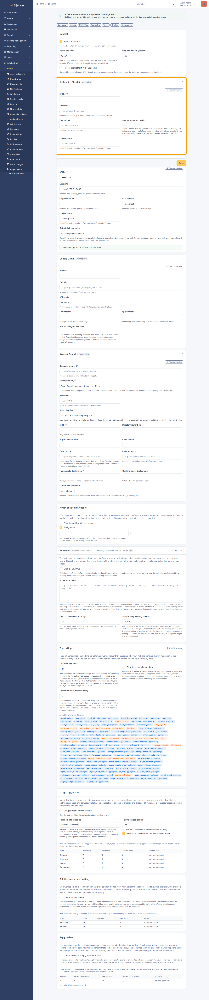
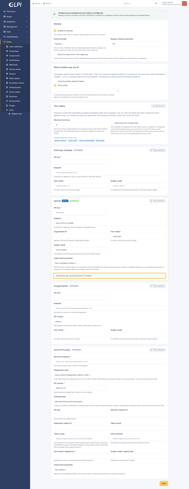
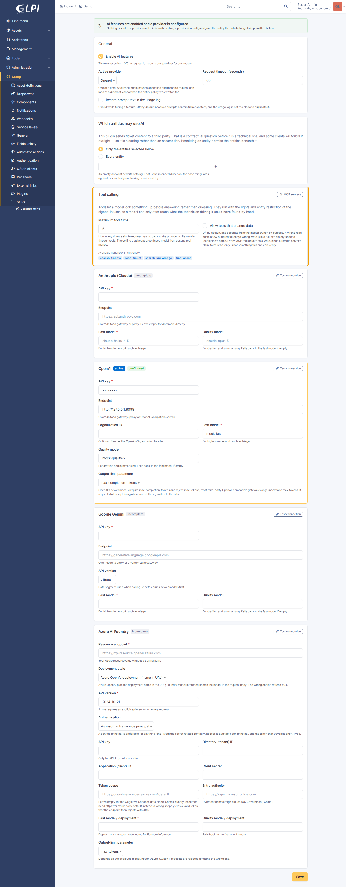
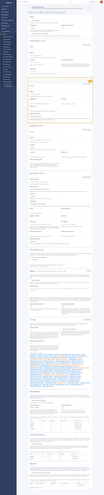

# GLPI AI

A vendor-neutral model layer for GLPI, and the place the AI features listed in
[docs/features.md](https://gitlab.rfni.dev/norsewind/glpi-erpnext-mods/-/wikis/glpi-ai/features) will be built.

Underneath is the substrate everything else depends on, and it was built first
on purpose: one normalised request vocabulary, four provider adapters, tool
calling with a registry other plugins extend, a per-entity gate on whether data
may leave at all, and a record of what was asked, what answered, and what the
model went looking for.

On top of it sit the features a technician sees: triage suggestions, which
propose what a newly arrived ticket is about; drafting, which writes the
solution and the knowledge article from what actually happened on the ticket;
and **HEIMDALL**, a troubleshooting agent that can go and look — at the network
inventory, at a switch port, at what an endpoint is doing right now.

Requires GLPI 11.0 or later. Depends on nothing outside GLPI's own vendor tree.

---

## What it does today

- **One API for four vendors.** Anthropic, OpenAI, Google Gemini and Azure AI
  Foundry, each reachable at a custom endpoint. Callers build a `Prompt` and get
  a `Completion`; the differences between the four live in the adapters.
- **Credentials encrypted at rest**, by GLPI, with GLPI's key — so
  `glpi:security:changekey` rotates them and the change history masks them.
- **A tenant gate.** Which entities may have their data sent to a provider is
  configuration, and the default permits nothing.
- **Tool calling**, on all four vendors: fifteen native tools over GLPI's own
  data — ten reads (tickets, changes and problems, assets, people, and what
  GLPI recorded changing on any of them) and five writes (an internal note, a
  task, the ticket's filing, a link between tickets, an unpublished knowledge
  article) — a registry fourteen other plugins add to (glpi-change alone contributes seven), and an MCP client for
  connecting external servers, including **OAuth 2.1** discovered from the
  server's own URL with client-credentials or authorization-code grants —
  authenticating either as the instance or as **each technician's own account**,
  which each of them connects from *My settings → AI connections*. The
  writes are off until an administrator turns them on, none of them is
  customer-facing, and none of them deletes anything. Past eight registered
  tools the model searches for them rather than being handed all of them. See
  [docs/tools.md](https://gitlab.rfni.dev/norsewind/glpi-erpnext-mods/-/wikis/glpi-ai/tools).
- **Triage suggestions** on tickets that arrived as prose: a proposed category,
  urgency, impact and procedure, offered as chips above the ticket fields.
  Nothing is applied without a click, and every accept and dismiss is recorded —
  which is what turns "the AI seems decent" into a number per field. See
  [docs/triage.md](https://gitlab.rfni.dev/norsewind/glpi-erpnext-mods/-/wikis/glpi-ai/triage).
- **Solution and article drafting** from the evidence on a worked ticket — the
  followups, the tasks, and the checks a procedure recorded. The solution is
  offered inside GLPI's own editor and inserted
  only on a click; the article is created unpublished. See
  [docs/drafting.md](https://gitlab.rfni.dev/norsewind/glpi-erpnext-mods/-/wikis/glpi-ai/drafting).
- **HEIMDALL** — Helpdesk Endpoint Inspection, Monitoring, Diagnostics And Live
  Lookup — a troubleshooting agent in a panel over any page, which knows what
  the technician has open and can reach every registered tool, including
  glpi-osquery's live queries and glpi-netscan's SNMP findings. It reaches
  exactly what the technician driving it could have found by hand, and no more.
  The run **narrates itself as it happens**: each tool as it is called with the
  arguments it was given, what came back, the model's reasoning where the
  provider sends it, and the answer a word at a time — with a switch between
  keeping every step on screen and keeping only the one that is running. An
  answer that hits the output ceiling is carried on rather than cut off. Past
  conversations are listed in the panel and resume in place — the panel opens
  the thread for the page you are on, which is no help when the question you
  want back was asked somewhere else.
  See [docs/assistant.md](https://gitlab.rfni.dev/norsewind/glpi-erpnext-mods/-/wikis/glpi-ai/assistant).
- **Reply review** — the one place a model here touches customer-facing text,
  and it touches it by reading. A technician writing a reply can ask for a
  second read before sending: internal content carried across, an unexplained
  term, no statement of what happens next, the wrong tone. Remarks, never a
  rewrite; Save is never blocked. Off by default, because to spot a leak it has
  to be given the internal notes to compare against. See
  [docs/reply-review.md](https://gitlab.rfni.dev/norsewind/glpi-erpnext-mods/-/wikis/glpi-ai/reply-review).
- **A usage log**: provider, model, tier, token counts, duration and a prompt
  fingerprint, per entity and per user — and a separate audit trail of every
  tool call the model made.



## What it deliberately does not do

- **Talk to a customer.** Every feature here is technician-facing. The single
  customer-adjacent case is a model *reviewing* a reply a human wrote, never
  writing one — that is reply review above, and it returns remarks rather than
  text on purpose. See [docs/features.md](https://gitlab.rfni.dev/norsewind/glpi-erpnext-mods/-/wikis/glpi-ai/features) for why the line is
  where it is.
- **Fall back between vendors.** One provider is active at a time. A fallback
  chain sounds like resilience and means a request can land at a vendor the
  entity policy was never written for.
- **Do anything on install.** The master switch is off, no provider is selected,
  and the allowlist is empty.

---

## Setting it up

Setup → AI.

1. Fill in a provider's card — API key, model names, and an endpoint if you are
   going through a gateway. Save.
2. Press **Test connection**. This is the only thing that proves a configuration
   works: having the fields filled in is a different claim from the credentials
   being valid, the deployment existing, and the endpoint being reachable
   through whatever proxy sits in the way.
3. Choose the active provider and switch **Enable AI features** on.
4. Decide which entities are permitted.



Per-vendor specifics — Azure's two deployment styles, Entra service principals,
which output-limit parameter to pick, what to do when a gateway rejects a
schema — are in [docs/providers.md](https://gitlab.rfni.dev/norsewind/glpi-erpnext-mods/-/wikis/glpi-ai/providers).

### Tools



Tools let a model look something up before answering rather than guessing, and
— where an administrator allows it — write down what was found. They run with
the rights and entity restriction of the signed-in user, so a model can only
reach what the technician driving it could have done by hand; tools that change
data are off by default and switched on separately from the master switch.
External MCP servers are connected under Setup → AI → MCP servers.

[docs/tools.md](https://gitlab.rfni.dev/norsewind/glpi-erpnext-mods/-/wikis/glpi-ai/tools) covers the safety model, the fifteen native
tools, what the writes deliberately cannot do, how another plugin registers its
own, and what of MCP is supported.

### The entity gate



This plugin sends ticket content to a third party. For an MSP that is a
contractual question before it is a technical one, and some clients will forbid
it outright, so it is expressed as configuration rather than assumed.

Permitting an entity permits the entities beneath it, which is how an MSP
actually thinks about a client with a sub-entity per site. An empty allowlist
permits nothing, including the root entity — the failure this guards against is
precisely somebody not having considered the question yet, and a gate that
defaults to "everything" would protect nobody.

The entity is a required argument to `Client::complete()` rather than something
read from the session, because background work — cron, the mail collector, a
queue worker — has no session, and a gate that quietly resolved to entity 0
there would be no gate at all.

---

## Calling it from another plugin

```php
use GlpiPlugin\Glpiai\Client;
use GlpiPlugin\Glpiai\Prompt;

$prompt = Prompt::make(
    "Ticket: {$ticket->fields['name']}\n\n{$ticket->fields['content']}",
    'You are triaging helpdesk tickets. Answer only with the schema.'
)->withTier(Prompt::TIER_FAST)->withSchema([
    'type'       => 'object',
    'properties' => [
        'category' => ['type' => 'string'],
        'urgency'  => ['type' => 'integer'],
    ],
], 'triage');

try {
    $completion = Client::complete($prompt, (int) $ticket->fields['entities_id']);
    $suggestion = $completion->data;   // decoded, schema-shaped
} catch (AiException $e) {
    // $e->kind is one of: disabled, auth, rate_limit, server, invalid_request,
    // refused, transport. $e->isRetryable() and $e->userMessage() are for
    // deciding what to do and what to show.
}
```

For a request where the model may call tools, `Client::run()` is the equivalent
door — it is a loop over `complete()`, so the same guards hold on every turn
rather than only the first, and it returns a `Conversation` carrying every turn,
every tool call, and the summed cost.

`Client::complete()` is the only door. It is where the master switch, the entity
gate, the timeout ceiling and the usage record are enforced, once — a caller
that reached past it into `Registry` would be a caller that silently opts out of
the entity policy, and nobody would notice until a client asked.

### The two model tiers

Every provider is configured with a fast model and a quality one, and callers
say which shape of work they are doing rather than naming a model. Triage is
high-volume and low-value-per-call; drafting a resolution is the opposite.
Pinning both to one model means overpaying for one of them, and which model
each maps to is the administrator's decision, not the feature's.

### Portable schemas

All four vendors support constrained JSON output, through four request shapes
and three schema dialects — OpenAI demands `additionalProperties: false` and
every key in `required`; Gemini rejects `additionalProperties` outright and
wants types upper-cased. The adapters translate, but only what is translatable:
keep schemas to plain types, plain nesting, and `enum`. Anything exotic will
survive on some providers and be rejected by others.

`Prompt::$extra` is the escape hatch for genuinely vendor-specific parameters,
and is deliberately an ugly one — anything put there is not portable, and a
caller reaching for it is opting out of the abstraction for that call.

---

## The technician app

Everything above is a web surface, and the technician who most needs a machine
looked at for them is often the one standing in front of it. The four features
are therefore reachable from glpi-mobile over the high-level API, with the
rights of the `ajax/` endpoint each stands in for — thread ownership through
`Thread::mine()`, drafting through `Drafter::refusal()`, triage and drafting
through `Ticket::canUpdateItem()` — and central-interface only, like the rest of
this plugin.

| Method | Path | Purpose |
| --- | --- | --- |
| `GET` | `/GlpiAi/status` | what will actually answer, in the entity of the request |
| `GET` | `/GlpiAi/threads` | the caller's recent conversations |
| `POST` | `/GlpiAi/threads` | open or resume the thread for a context (`itemtype`, `items_id`) |
| `GET` | `/GlpiAi/threads/{id}` | one conversation with its transcript |
| `POST` | `/GlpiAi/threads/{id}/ask` | ask, and wait for the finished answer |
| `POST` | `/GlpiAi/threads/{id}/stream` | ask, and receive the run as server-sent events |
| `DELETE` | `/GlpiAi/threads/{id}` | clear a transcript |
| `GET`/`POST` | `/GlpiAi/tickets/{id}/draft` | the drafted solution, and asking for one |
| `POST` | `/GlpiAi/drafts/{id}/used` · `/discard` | what became of a draft |
| `GET`/`POST` | `/GlpiAi/tickets/{id}/triage` | the triage suggestion, and running it now |
| `POST` | `/GlpiAi/triage/{id}/apply` · `/dismiss` | accept or reject one proposed field |
| `POST` | `/GlpiAi/reply/review` | read a drafted reply before it is sent |

**Streaming, because a still spinner reads as a crash.** An agent run is four to
eight vendor round trips and takes the better part of a minute; on a phone that
is long enough for somebody to background the app, which kills the request.
`/threads/{id}/stream` therefore speaks the same events as
`ajax/assistant-stream.php` — `turn`, `tool`, `tool_result`, `thinking`,
`text`, `continued`, `done`, `failed`, plus an `open` frame — through the same
`Progress` sink, so there is one narration and not two. It is a Symfony
`StreamedResponse` wrapped in the HL API's `StreamedResponseWrapper`, which is
what keeps the router from sending headers and stringifying a body that does not
exist yet.

The `/status` route exists because the capability map cannot answer for it. That
map is computed once per session; the **entity gate is not a session property**
— the technician can switch entity in the app — and "may this customer's data
reach a provider" is decided per entity. Asking again in the entity of the
request is the difference between a control that is absent and a control that
takes a question and then refuses it.

Feature discovery goes through glpi-mobile's `glpimobile_capabilities` hook
(`plugin_glpiai_mobile_capabilities()` in `setup.php`): `assistant`, `draft`,
`reply_review`, `triage` — all false outside the central interface.

## Tests

Nine PHP suites and five browser suites, none of which need a real credential
or any network egress.

```sh
# Wire formats and the policy layer, inside the container.
docker compose -p glpi exec glpi sh -c 'cd /var/www/glpi/plugins/glpiai && tests/run.sh'

# The settings page, triage, and drafting.
cd glpi-ai/tests/browser && ./ai-setup.sh start && node ai-check.js
node triage-check.js && node drafts-check.js
node assistant-check.js
./ai-setup.sh stop
```

- `tests/adapters.php` — the one that matters most. Translation is the only
  thing this code is responsible for, and every mistake in it has the same
  shape: a request that looks entirely plausible and is accepted by nobody. It
  drives all four adapters from one identical `Prompt` against a mock vendor API
  and asserts on what each one *sent*.
- `tests/tools-wire.php` — the same discipline for tool calling, where the
  surface is larger and the failure quieter: three shapes per vendor, and
  getting one subtly wrong produces a model that simply stops calling tools.
- `tests/integration.php` — settings persistence, encryption at rest, the tenant
  gate against a real entity tree, and the guards on `Client::complete()`. It
  restores the configuration and purges the entities it creates.
- `tests/tools.php` — the rights, the entity scoping, the write switch, the
  agent loop, the audit trail, and the MCP client against a mock server.
- `glpi-ai/tests/browser/ai-check.js` — the settings page, including the two things
  only a browser reaches: the connection test's CSRF handling, and that saving
  the page does not wipe the credentials it is not showing you.
- `tests/triage.php` — eligibility, the taxonomy as an allowlist, a
  hallucinated category being discarded, and the arithmetic of the accept rate.
  Several assertions exist only to check that the ticket is *unchanged* at
  points where it would be easy for it not to be.
- `tests/drafts.php` — the evidence gatherer, both schemas, and the outcomes.
  Several assertions exist only to check what *did not* happen: that no solution
  was written to the ticket, and that a created article has no visibility rows
  at all.
- `glpi-ai/tests/browser/drafts-check.js` — the drafts tab and the strip inside GLPI's
  own solution editor. Its central assertion is that after clicking Insert the
  editor holds the draft and the ticket still has no solution on it.
- `tests/native-tools.php` — the deeper reads and the writes, driven through
  `ToolRegistry::execute()` rather than by calling the handlers, because for a
  write tool most of the interesting behaviour is not in the handler: the write
  switch, the profile right and the missing-argument check all live on the path
  a model actually takes. Its sharpest assertions are negative — that a note
  cannot be made public even when `is_private` is passed, that a `status`
  argument is ignored, that a link needs rights at both ends, and that a
  created article really has no visibility rows.
- `tests/reply.php` — where the strip draws and where it must not, the flags
  that survive validation, and the outcome. The mock answers a review by
  comparing the ticket's *internal* notes with the reply, so "the internal
  notes reached the prompt" is a checked fact — an assembly failure there would
  otherwise come back as a perfectly plausible remark about tone.
- `tests/streaming.php` — the three adapters that stream, and the event
  channel. The mock chops its text mid-word and splits every tool call's JSON
  arguments across frames on purpose: an adapter that buffered the whole stream
  and called back once would produce an identical `Completion` and show a
  technician nothing until the end, so the assertions are on the *number* of
  fragments as much as their content. It also holds the rule that thinking
  never becomes the answer.
- `tests/mcp-user-auth.php` — MCP servers that authenticate the person rather
  than the instance. The assertions are mostly about what one person's
  credential does *not* do: another technician's lookup finds nothing and their
  call is refused; a run with no signed-in person is refused rather than
  falling back to whichever grant exists; the in-flight authorization lives on
  the person's own row so two people can connect at once; and nothing personal
  is ever written to the server record an administrator can read.
- `tests/oauth-toolbox.php` — the OAuth grants against a mock authorization
  server that actually checks the client secret, the PKCE verifier and whether a
  code has been used already; and the tool-search threshold, ranking and the
  wire that makes a found tool callable on the next turn.
- `tests/assistant.php` — the conversation, and the tools. The network tools
  are driven against a real switch, laptop and cable so that "follows a cable"
  is a checked fact, and the live-query guards are asserted directly rather than
  through a model, because a guard that only holds when a model behaves is not a
  guard.
- `glpi-ai/tests/browser/assistant-check.js` — the panel: that it knows which record
  is open, that a different record gets its own conversation, that coming back
  resumes the first, that past conversations are listed and reopen from a page
  they were not had on, and that a requester never sees the launcher.
- `glpi-ai/tests/browser/triage-check.js` — the panel, the chips, and who can see
  them. It signs in as an ordinary Technician, because the people this feature
  is for are exactly the people who do not hold the plugin's configuration
  right, and as a self-service user, because they must never see it at all.

`tests/mock-provider.php` is the stand-in for all four vendors plus Microsoft
Entra, and `tests/mock-mcp.php` for an MCP server — which also plays its own
authorization server, since that is what small MCP deployments are. Both answer
in the real shapes, including the unhappy ones that arrive as a successful HTTP
response — a refusal, a safety block, a content filter, a tool reporting its own
failure — since those are the easiest to mistake for a working call that
returned nothing.

For triage the mock does something more pointed: it parses the category list
back out of whichever field that vendor puts the system instruction in, and
answers by word overlap with the ticket. A canned response would sail through an
assembly failure — a taxonomy that never reached the prompt, a ticket that never
reached the user turn — because both produce a perfectly well-formed request.

### Against a real model

`tests/live-ollama.php` runs triage, drafting and the assistant against a live
Ollama host. It is opt-in and not in `run.sh`, because a suite that needs a GPU
on the network is a suite that gets skipped — but a mock can only prove the
plugin sent what it meant to send, and the claim here is about what a *model*
does.

```sh
docker compose -p glpi exec glpi sh -c \
  'cd /var/www/glpi/plugins/glpiai && OLLAMA=http://host:11434 \
   CHAT=some-model php tests/live-ollama.php'
```

It found three things a mock structurally could not: that a base URL ending in
`/v1` produced `/v1/v1/chat/completions` and a bare 404; that a reasoning model
spends its whole output budget thinking and returns an empty message; and that a
small model will carry a department name into a knowledge article unless the
instruction says, in those words, to take team names out.

---

## Layout

```
setup.php            hooks, and the SECURED_CONFIGS declaration that makes
                     GLPI encrypt the credentials
hook.php             install/uninstall: the tables, one right
src/Prompt.php       the neutral request — the intersection of what all four
                     vendors can do, not the union
src/Client.php       the one door: master switch, entity gate, timeout, logging
src/Settings.php     configuration, including the secret round-trip
src/UsageLog.php     what every call cost and which model answered
src/ToolLog.php      what the model went looking for, and on whose behalf
src/Tool*.php        the tool vocabulary: definition, call, result, context,
                     invocation, and the registry that assembles them
src/Conversation.php the record of one agent run
src/Provider/        Registry, the Provider contract, Field, and the four
                     adapters
src/Tools/           the native tools — the reads, the writes, and the
                     rights-respecting search they all go through
src/Mcp/             the MCP client, the configured-server item, the OAuth 2.1
                     flows, the per-technician credentials for servers that
                     authenticate people, and the catalogue that turns a server
                     into tools
src/Toolbox.php      tool search, for when there are more tools than a model
                     should be handed at once
src/Triage/          the taxonomy a model chooses from, the stored suggestion
                     and its outcome, the service, and the panel
src/Draft/           what happened on a ticket, the two drafts made from it,
                     the tab, and the strip inside GLPI's solution editor
src/Assistant/       the conversation, the context it starts from, and the
                     service that runs the agent loop over every tool
src/Progress.php     what the run is doing, for whoever is watching it
src/MobileController.php
                     the four features over the high-level API, for the
                     technician app — including the assistant streamed as
                     server-sent events
ajax/assistant-stream.php
                     the same question, answered over server-sent events
src/Reply/           reply review: the reviewer, the strip in the followup
                     editor, and the record of whether the reply changed
front/config.php     the settings page, generated from the declared fields
front/mcp/           the MCP server list and form
ajax/test.php        the connection test
docs/features.md     the roadmap this substrate exists for
docs/providers.md    per-vendor configuration
docs/assistant.md    HEIMDALL: the troubleshooting panel, and what it can and
                     cannot reach
docs/drafting.md     solution and article drafting, and where each one lands
docs/tools.md        tool calling and MCP
docs/triage.md       triage suggestions, and how their accuracy is measured
docs/reply-review.md reading a reply before it is sent, and what it may say
```

Adding a fifth vendor is one class and one line in `Registry`. The settings
form, the save handler, the uninstall key list and the connection test all read
from the registry and the declared `Field`s, so none of them needs a per-vendor
branch — which is what stops the fifth vendor from being a class *plus* three
forgettable edits elsewhere, all of which fail silently by simply not saving a
field.

## Install

```bash
# from the GLPI root — the directory has to be named for the plugin
# key, which is not the repository name
git clone https://github.com/bijstaan/glpi-ai.git plugins/glpiai
php bin/console plugin:install -u glpi glpiai
php bin/console plugin:activate glpiai
```

## Licence

GNU General Public License, version 3 or later — the same licence as GLPI.
This plugin is loaded into GLPI's process and extends its classes, so it is a
derivative work of GLPI and carries GLPI's licence. See [LICENSE](LICENSE).
