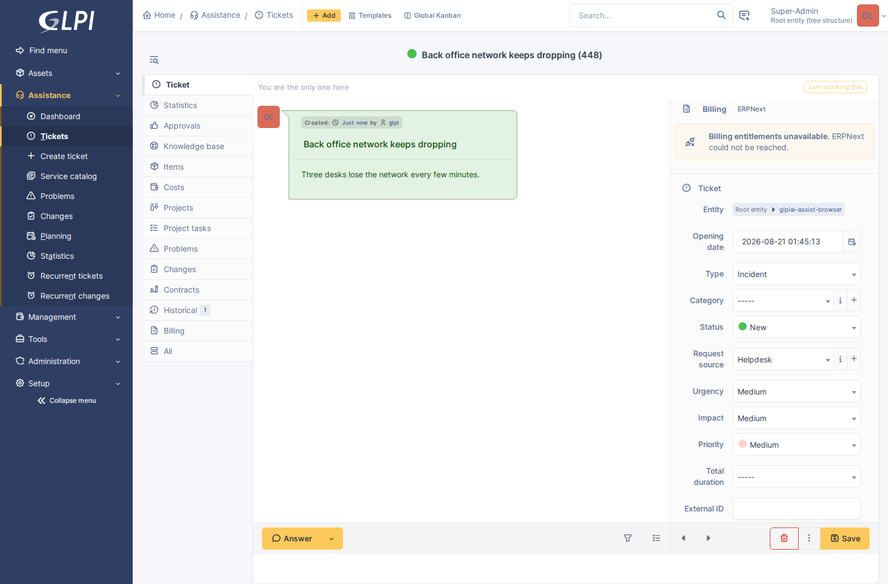
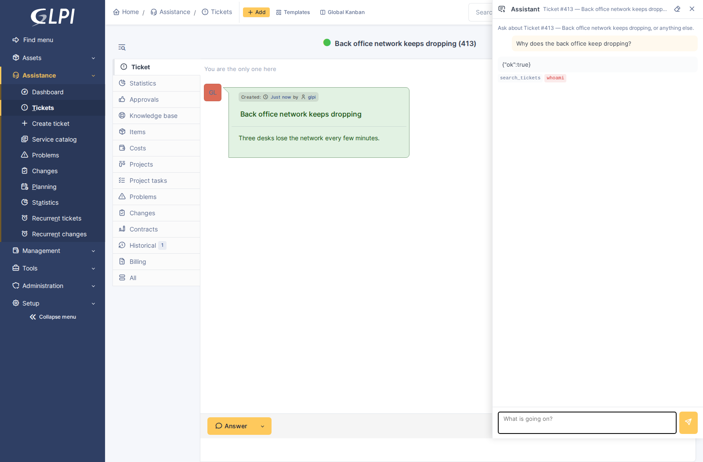

# HEIMDALL

**H**elpdesk **E**ndpoint **I**nspection, **M**onitoring, **D**iagnostics
**A**nd **L**ive **L**ookup.

Also Heimdallr, a god of the Æsir, recorded in the Poetic Edda and in Snorri
Sturluson's Prose Edda in 13th-century Iceland: the watchman of the gods and
warden of Bifröst, the burning rainbow bridge to Asgard. He is said to need less
sleep than a bird, to see a hundred leagues by night as well as by day, and to
hear wool growing on a sheep and grass growing in the ground. He keeps
Gjallarhorn, the resounding horn, and will sound it when Ragnarök comes.

The acronym was fitted to the name rather than the other way round, and the
agent will tell you so if you ask it. It knows all of the above, and is
instructed not to volunteer any of it — somebody mid-problem wants the answer.

A panel a technician opens from any page. It knows what they have open, it
remembers the conversation, and — the part that matters — it can go and look.

The launcher sits in the header, beside the search box:



That is where it is because of where it is *not*. It began as a floating button
in the bottom-right corner, which is precisely where a GLPI form puts Save — so
it covered the one control on the page people press most. The header is the row
that already holds the things you reach for regardless of what is on screen.



---

## Why the tools are the feature

Ask a model why a laptop keeps losing the network and it will produce a
competent list: check the cable, check the driver, check the switch port. The
technician knew that. It is fluent, it is plausible, and on its own it is worth
nothing.

Ask the same model the same question with `network_trace` in its hands and it
comes back with:

> The laptop `glpiai-laptop-42` is plugged into **`glpiai-sw-back-office`** on
> port **`glpiai-Gi1/0/7`**. The port looks healthy in terms of status and
> speed, but it is showing a high number of errors which likely correlates with
> the connection drops: incoming errors 20,431, outgoing 12.

That is a real transcript from a small self-hosted model, and the difference is
not the model. It is that one of them looked.

This is the feature the tool registry was built for, and it is the first thing
in the plugin that offers the model **every** registered tool rather than a
chosen few — including tools contributed by other plugins.

---

## What it can reach

| Tool | Answers |
|---|---|
| `search_tickets`, `read_ticket` | has anyone seen this before, and what was done |
| `search_knowledge` | is there a documented procedure |
| `find_asset` | turn a vague mention of a machine into the record |
| `network_trace` | where is this MAC, IP or hostname plugged in |
| `network_ports` | what are that switch's ports doing |

With **glpi-osquery** installed:

| Tool | Answers |
|---|---|
| `osquery_agents` | which machines have an agent, and are they awake |
| `osquery_tables` | what can be queried on that platform |
| `osquery_live` | *what is happening on that machine right now* |

With **glpi-netscan** installed:

| Tool | Answers |
|---|---|
| `network_alarms` | what did devices report overnight, with timestamps |
| `power_status` | is the UPS on battery, and for how long |
| `wireless_status` | which access point is carrying everybody |

Plus any tool an MCP server offers, and any tool another plugin registers
through the `glpiai_tools` hook.

---

## What it cannot reach

**Exactly what the technician driving it cannot.** Every tool declares the GLPI
right it needs and is refused without it; every query is scoped to the entities
of the signed-in session; and every call is written to the tool log under that
person's name.

There is no service account, no elevated context, and no path by which asking
nicely gets more than clicking would have.

### Live osquery specifically

`osquery_live` sends a query to real endpoints, so it is worth being precise
about the gate: it requires `plugin_glpiosquery_rawsql` at UPDATE — the same
right glpi-osquery's own console checks, and one that **plugin grants to nobody
by default**. Somebody who cannot type a query into the console cannot have the
assistant type one either.

Beyond that:

- **SELECT only**, one statement, validated by the same rejector the console
  uses. `DELETE`, `DROP` and stacked statements are refused with a reason, which
  the model reads and can correct from.
- **Agent ids are resolved through the entity restriction in SQL**, so an agent
  belonging to another customer cannot be reached by guessing its number.
- **Silence is reported, not hidden.** A campaign is asynchronous; machines that
  are asleep or off the network do not answer. The result says how many did not,
  because a model told "no machine has that file" when three never replied will
  conclude the file is gone.

---

## Watching it work

An agent run is four to eight round trips to a vendor with tool calls in
between, and it takes fifteen to sixty seconds. The panel used to send the
question and wait, which is indistinguishable from a request that died —
people pressed the button again and started a second run.

So the run narrates itself, over server-sent events from
`ajax/assistant-stream.php`:

| What you see | When |
|---|---|
| A pulsing status line | From the moment the question is sent |
| `Step 2 of 12…` | Second turn onwards — a run that answers in one turn never mentions steps |
| A tool row, with the arguments the model chose | Before the tool runs |
| Its duration, and **what came back** behind a disclosure | When it answers |
| *Thinking*, collapsed | Where the provider sends reasoning; see below |
| The answer, a word at a time | As the model writes it |

The arguments matter as much as the name. A model that searched for the wrong
words looks identical to one that searched for the right words until you can
see the query, and it is the half a technician can judge instantly. The result
is behind a disclosure rather than on the page — it is the evidence, wanted
when an answer looks wrong and noise the rest of the time — and it is capped at
1,200 characters, because a full osquery result would push the conversation off
the screen to make a point the first few lines make.

What the model says on its way to a tool ("let me check that") moves above the
tool row when the call starts, so it does not run into the next turn's prose.
The finished answer replaces the streamed text at the end with the
server-rendered markdown, so lists and code blocks arrive properly formatted.

### How much of the working to show

The button in the panel header switches between two ways of watching a run, and
the choice is remembered per browser:

| Mode | What stays on screen |
|---|---|
| **Latest step** (default) | The step that is running. Finished ones fold into a line — *3 earlier steps* — that opens them again |
| **Every step** | All of them, with their arguments and results, and the thinking block opens itself as the reasoning arrives |

The first is closer to how the vendors' own chat interfaces behave and is the
right default for somebody who wants the answer. The second is the whole
working, which is what makes an answer checkable — and this plugin's position
everywhere else is that an answer from looking at the machine and an answer from
general knowledge read identically, so the difference has to be visible.

Nothing is ever thrown away in compact mode: the folded steps are one click
away, and switching mode reflows a run that is already on screen, including one
still in progress. The preference is in `localStorage` rather than the database
— it is a fact about one person's screen that changes nothing anybody else
sees.

### Thinking

Where the provider will part with its reasoning, it appears in a collapsed
*Thinking* block as the model produces it.

| Provider | Thinking | How |
|---|---|---|
| **Google Gemini** | Yes | *Ask for thought summaries* on the provider card — `thinkingConfig.includeThoughts` |
| **Anthropic** | Yes | *Ask for extended thinking* on the provider card |
| **OpenAI** | No | Reasoning summaries live on the Responses API; this adapter speaks Chat Completions |
| **Azure AI Foundry** | No | Same adapter, same reason |

Both are **off by default**, and for different reasons. Gemini rejects
`includeThoughts` outright on a model that does not think, so leaving it on
would turn every request into an HTTP 400 on the wrong model. Anthropic's
extended thinking is charged as output tokens and roughly half of each answer's
ceiling is set aside for it, so it costs money on every call — not only the
ones somebody is watching.

Thinking is never part of the answer. It is not appended to the reply, not
stored in the thread, and not replayed to the model on the next turn: it is the
model's working, and presenting it as its conclusion is exactly what both
vendors ask callers not to do.

### When the answer runs out of room

The complaint this fixes: *the answer keeps getting cut off, sometimes short,
sometimes just as it was finishing.*

A model that reaches its output ceiling stops mid-sentence and reports it as an
ordinary finish reason. The text is fluent and stops somewhere plausible, so
nothing about a truncated answer says the last third is missing. On a
**reasoning model** it is much worse than it sounds, because the ceiling covers
the thinking as well as the prose — the whole allowance can go on reasoning,
and what arrives is a fragment or nothing at all.

Three things address it, in order:

1. **The ceiling is a setting**, *Answer length ceiling*, and it defaults to
   **8,000** rather than the 2,000 it was hard-coded at. A ceiling is not a
   cost: nothing is charged for output that is not produced.
2. **The loop carries the answer on.** When a turn comes back truncated, the
   partial answer goes back as the model's own turn with an instruction to
   continue from exactly where it stopped, and the pieces are joined with
   nothing between them. Up to three times, tools off — the model was
   answering, not investigating.
3. **If it is still short, the panel says so**, rather than presenting three
   quarters of an answer as a whole one.

Continuation is for prose only. A caller with a JSON schema — triage, drafting
— is never continued, because two JSON fragments joined are not JSON; those
retry with a bigger ceiling instead, which is the right move for a structured
answer.

Each continuation is a separate round trip with the transcript on it, so it is
separately billed and separately logged. `Conversation::usage()` sums them,
which is why a long answer costs what it says it costs.

### When it does not stream

Streaming needs an adapter that implements it — Anthropic, OpenAI, Azure and
Gemini all do — and a connection that will carry it. Where either is missing,
the panel falls back to the plain JSON endpoint and shows the answer when it
arrives, which is what it did before. The tool narration is lost with it,
because those events are the stream.

Two things break streaming quietly if they are in the way: a reverse proxy that
buffers responses (the endpoint sends `X-Accel-Buffering: no`, which nginx
honours), and any PHP output buffering left open by the stack, which the
endpoint closes before its first byte.

## Context

The panel opens over the page rather than replacing it, and reads what that page
is about from the URL. Open it on a ticket and the ticket is context; open it on
a computer and the computer is.

Nothing about that is trusted. The itemtype and id come from JavaScript, so both
are validated against a list of supported types and the record is loaded through
GLPI's own rights check before a word of it reaches a prompt. A record the
technician may not see resolves to no context at all.

Context is **offered**, not asserted — the instruction says "this is what they
have open, it may be irrelevant", because people open the panel from wherever
they happen to be and ask about something else.

Conversations are keyed by user *and* context: a thread about one machine is
rarely a useful starting point for a question about another. Navigate away and
back and the conversation is still there.

---

## Conversations

Stored, and readable only by the person who had them. A conversation is one
technician's working notes — half-formed questions, guesses that turned out
wrong — and no profile right expresses "may read other people's thinking", so
access is by ownership.

Only the prose is replayed on a follow-up question, not the tool results. That
is deliberate: tool output is the bulk of a transcript by a wide margin, it is
stale by the next question — a disk that was full ten minutes ago may not be —
and every provider charges for it again on every subsequent turn. What survives
is what the model concluded.

Threads are pruned on the retention period set on the settings page, and a
conversation about a record is deleted with the record.

### Finding one again

The panel resumes by *context* — open it on a ticket and you are back in that
ticket's conversation — which is exactly right for "I am on this again" and no
help at all for "what did it say about that switch on Tuesday". The thread was
still there; there was simply no way back to it once you had left the page.

The clock icon in the panel header lists them, newest first: what was asked
(a thread is named from its first question and never renamed, so the title *is*
the question), what it was about, and when. Picking one swaps the transcript in
place — nothing navigates, and the panel's context line changes to the
conversation's, not the page's.

Three details worth knowing:

- **Empty threads are not listed.** Opening the panel creates one whether or
  not anything is asked, so a raw list is mostly page visits. Only threads with
  turns in them appear.
- **The list is scoped in the query, not filtered afterwards.** Ownership is
  the whole access rule, and a list is where a forgotten filter would be least
  visible.
- **It refuses to swap while a question is running.** The answer being streamed
  belongs to the thread on screen, and changing it underneath would file the
  answer against a conversation the reader is no longer looking at.

### On a phone

The same conversations, through glpi-mobile: `/GlpiAi/threads` opens or resumes
a thread for a context, `/GlpiAi/threads/{id}/stream` runs a question and
narrates it, and `/GlpiAi/threads` lists the caller's recent ones. The app
needed that list first — a browser keeps the panel open across navigation and a
phone does not — and the panel has since grown the same one, from the same
`Thread::recent()`. Both are the same conversations: a thread started on a
phone resumes in the panel and the other way round.

Ownership is the access rule there too — the routes go through `Thread::mine()`
— and the app never sees a thread it did not start. See the README's *technician
app* section for the endpoints.

---

## Cost

The **quality** tier, and a turn budget of twelve rather than the plugin default
of six. That default was kept low deliberately, and this is the case it was kept
low *for*: a troubleshooting question genuinely is "find the machine, look at
its disks, check whether anyone else reported this, read that ticket" — four
tools before a word of the answer — and a budget that stops at six hands back a
half-investigated guess.

If the budget runs out with the model still working, the panel says so and
suggests asking again. The answer it gives is real, just less informed than it
wanted to be.

---

## Adding your own tools

Any plugin can contribute:

```php
$PLUGIN_HOOKS['glpiai_tools']['myplugin'] = [MyPlugin\AiTools::class, 'all'];
```

Return `Tool[]`. Declare the `right` your tool needs — and `right_level` if it
is not READ — and the registry does the rest: the assistant offers it, the
refusal reason goes back to the model in words it can act on, and every call is
logged.

A plugin whose tool list throws costs its own tools, not the whole feature.

See [tools.md](tools.md) for the contract.

---

## When it is unhelpful

- **It answers only from general knowledge.** Look at the tool chips under the
  answer: if there are none, it did not look. Ask it to check, or name the
  machine — a question with a hostname in it reliably sends it to `find_asset`.

  General knowledge *on top of* what it found is not a fault, and is often the
  most useful part: there is no tool for "what usually causes this". It is
  instructed to keep the two distinguishable — *"the port is showing 18,000
  input errors; that pattern is usually a duplex mismatch or a bad pair"* is
  the shape to expect, with the first half from the switch and the second from
  the model. What it must never do is present something it recalled as
  something it checked.
- **"I ran out of steps."** The turn budget. Ask again; the conversation
  carries, so it resumes from what it already knows.
- **A tool chip is red.** That call failed. Hover it for the arguments — most
  often the model guessed an id, which is the loop working rather than a defect.
- **Nothing happens on the portal.** By design. The launcher renders only in the
  technician interface, and the endpoint refuses anything else.
