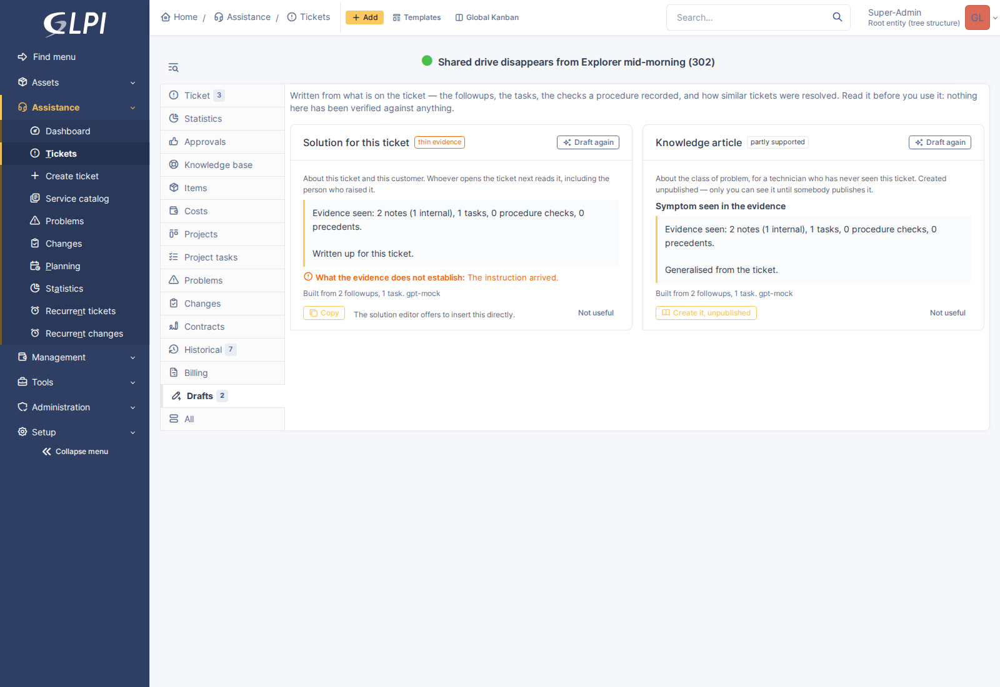
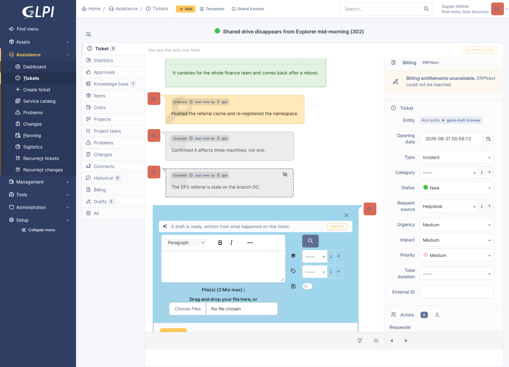

# Solution and article drafting

A ticket has been worked. There are three followups, a task, and a procedure
somebody ticked through. Somewhere in there is what was actually wrong — and
writing that up is the part of the job everybody puts off, because the evidence
is scattered across a timeline nobody wants to reread.

Drafting reads it and writes two different things from it.

---

## Two artefacts, not one with a switch

They are genuinely different jobs, which is why they are separate drafts with
separate prompts:

|  | **Solution** | **Knowledge article** |
|---|---|---|
| About | this ticket, this customer | the class of problem |
| Read by | whoever opens the ticket next, including the requester | a technician who has never seen this ticket |
| Keeps | names, hosts, specifics | none of them |
| Lands in | GLPI's solution editor | an unpublished knowledge item |

A model told to do both at once does neither. Ask for a solution and you get
this ticket written up; ask for an article and you get the fault described so
somebody hitting it elsewhere, months later, recognises it.

---

## What it is written from

This is the whole difference between the feature and a chat window. Drafting
from a ticket's title produces a fluent invention. Drafting from the evidence
produces something worth reading.

- **The timeline** — every followup and task, oldest first, with private ones
  marked. Private entries are included because that is usually where the
  diagnosis is: a technician writes *"it was the stale DFS referral"* to
  colleagues, not to the requester.
- **Procedures** — if **glpi-sop** is installed, every step somebody answered,
  with the answer. The most valuable evidence there is and the only kind that is
  not prose, because a procedure records what was *checked* — including the
  checks that came back clean. "The disk was not full and the service was
  running" is something a draft should be able to say, and nothing else on a
  ticket records it.
- **Machine state** — **glpi-osquery** needs no integration at all here. It
  already writes its before-and-after findings into the timeline as a followup,
  so reading the timeline collects it.

A plugin that is not installed contributes nothing and changes nothing else.

Each draft shows what it was built from — *"2 followups, 1 task, 4 procedure
steps"* — so a thin draft is visibly thin rather than merely wrong.

### It refuses when there is nothing to go on

A ticket with a title and no followups gets no draft, and says so. This is
deliberate and it is not a limitation: a plausible paragraph written from a
title is *more* likely to be posted than an honest refusal, because it reads
like work somebody already did.

---

## Where the drafts land

### The solution

Not prefilled. GLPI's solution editor opens empty, exactly as it always did,
with one line above it offering the draft:

**Insert it** puts the text *in the editor* — not in the database. The
technician still reads it, still edits it, and still presses Save. Every one of
those is a place to notice the model was wrong, and none has been removed.

The alternative designs were both worse. Prefilling the field puts generated
prose one Save away from something the requester reads, on a form the technician
did not ask to have written for them. Leaving it in the tab to be copied by hand
is safe and tedious enough that people stop bothering.

### The article

**Created unpublished.** GLPI decides who can read a knowledge article from its
visibility rows, and a draft is created with none — which means only its author
can see it, until a human gives it visibility.

That is the entire safety mechanism for this half of the feature, and it is
deliberately not configurable. An option to publish on creation would be one
checkbox between a model's prose and a customer-facing knowledge base, and
somebody would tick it.

The article is linked back to the ticket it came from, so each stays findable
from the other.

---

## What it tells you it does not know

Every solution draft carries a **gaps** line: what the evidence does not
establish. It is the most useful thing on the card and the easiest to skip,
which is why it is coloured.

From a real run:

> *"While the technician confirmed the resolution with two of the three affected
> machines, there is no confirmation from the third machine that the referral
> was successfully fixed and remains stable."*

Nobody wrote that down. It is the difference between the notes and a complete
account, and it is the sort of thing a reviewer would catch — which is what the
draft is standing in for.

There is also a confidence badge, and **thin evidence** is the one that is
coloured. "Unsure" said quietly reads exactly like "confident", and acting on
the difference is the point of showing it.

---

## Measuring it

The settings page reports how often each kind of draft was actually used:

| Kind | Used | Discarded | Undecided | Use rate |
|---|---|---|---|---|
| Solutions | 61 | 12 | 9 | **84%** |
| Articles | 8 | 21 | 3 | **28%** |

Same argument as triage's accept rate: without it, "the drafts seem decent" is
the most anyone can say, and a regression after a vendor changes a model under
you is invisible. Split by kind because the numbers above are what it looks like
when one half is earning its keep and the other is not.

Undecided drafts count as neither.

---

## Cost and model choice

The **quality** tier, not `fast` — the opposite of triage, and for the opposite
reason. Triage is high volume and low value per call; a draft happens once per
ticket, at a moment a technician chose, and the output is prose somebody will
either use or rewrite.

There is no queue and no cron. A draft is produced when the button is pressed,
which takes as long as the model takes: on a small self-hosted model, fifteen to
twenty seconds.

The output budget is 3000 tokens for output that is rarely more than four
hundred. That ratio is not waste — a reasoning model spends its allowance
thinking before it writes anything, and a budget sized for the answer comes back
with `finish_reason: length`, an empty message and a thousand words of discarded
thought. If it happens anyway, the panel says so in those words.

---

## Rights

Reading a draft takes no more than reading the ticket. Producing one takes
`Ticket::canUpdateItem()` — the same right a technician needed to write the
solution by hand — because producing one spends money at a provider. Creating an
article additionally needs GLPI's own knowledge-base create right: somebody who
may resolve tickets is not automatically somebody who may write the knowledge
base.

Nothing renders in the helpdesk interface. A requester never sees a draft about
their own ticket.

---

## When it does not work

- **No tab.** Drafting is switched off, or you are in the helpdesk interface.
- **"There is nothing on this ticket to draft from yet."** The ticket has no
  followups, no tasks and no procedure. Working the ticket is the fix.
- **The draft ignores something obvious.** Check the *built from* line. If it
  says "the ticket description only", the evidence did not reach it — most
  often because the followups are on a linked ticket rather than this one.
- **An article carried a customer detail across.** It happens with small models,
  which is exactly why articles are created unpublished. Read before you
  publish; that is the step the design assumes you take.
