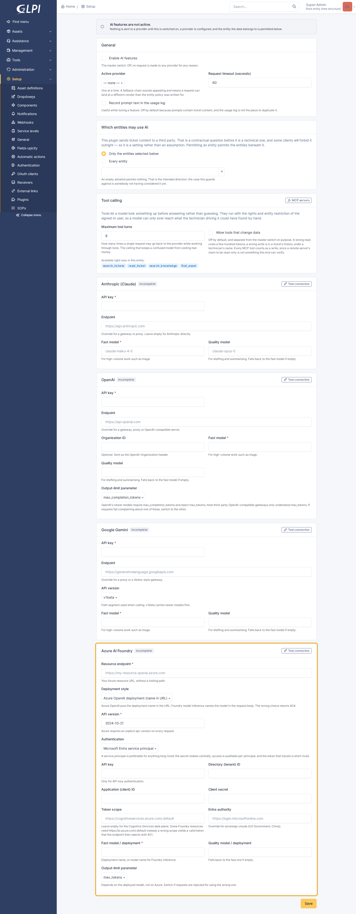
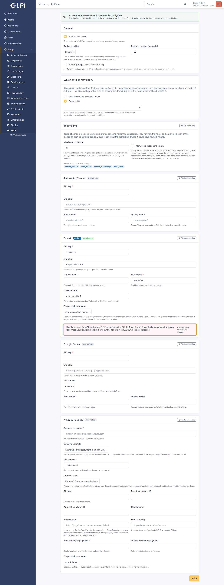

# Provider configuration

Four adapters, one settings page, and the vendor-specific detail that page
cannot fit into a help string.

Every provider takes a custom endpoint, so any of them can be pointed at a
gateway, a proxy, or a compatible self-hosted server. Every provider takes two
model names — a fast one and a quality one — because callers ask for a *tier*,
not a model, and which model each tier means is your decision. If the quality
model is left empty, the fast one is used for both.

Nothing is sent anywhere until the master switch is on, a provider is selected,
**and** the entity the data belongs to is on the allowlist.

---

## Anthropic (Claude)

| Field | Notes |
|---|---|
| API key | Sent as `x-api-key`. Not a bearer token. |
| Endpoint | Default `https://api.anthropic.com`. |
| Fast model | e.g. `claude-haiku-4-5` |
| Quality model | e.g. `claude-opus-5` |

The adapter posts to `/v1/messages` with the API version pinned to
`2023-06-01`. Pinned rather than floating: the header is a dated API contract,
and letting it track "latest" would mean a breaking change arriving on
Anthropic's release schedule rather than on yours.

**Temperature is dropped, not forwarded.** The current models reject
`temperature` with a 400 rather than ignoring it, so a caller's value would turn
an advisory hint into a hard failure. If you need sampling control on Claude,
`Prompt::$extra` is the honest way to ask for it.

The system prompt travels as a top-level `system` field, and a policy decline
arrives as a **200 with `stop_reason: refusal`** rather than an error status —
the adapter raises `AiException::REFUSED` for it, so a decline never reads as a
successful call that happened to return nothing.

---

## OpenAI, and OpenAI-compatible gateways

| Field | Notes |
|---|---|
| API key | Sent as `Authorization: Bearer`. |
| Endpoint | Default `https://api.openai.com`. |
| Organization ID | Optional; sent as `OpenAI-Organization`. |
| Fast / quality model | |
| Output-limit parameter | `max_completion_tokens` (default) or `max_tokens`. |

The adapter uses **Chat Completions** (`/v1/chat/completions`) rather than the
newer Responses API, deliberately. This is also the adapter people point at
LiteLLM, vLLM, OpenRouter or an enterprise proxy, and `/v1/chat/completions` is
the shape all of those actually speak. The newer API would buy features this
layer does not expose and lose most of the compatibility that makes the custom
endpoint worth having.

**If requests fail complaining about the token parameter, switch it.** OpenAI's
newer models require `max_completion_tokens` and reject `max_tokens`; most
third-party compatible gateways only understand `max_tokens`. There is no way to
detect which from the outside, so it is a setting.

The system prompt becomes a message with role `system` — not `developer`,
because the gateways this adapter also serves have not universally followed that
rename, and `system` is still accepted everywhere.

A content-filter stop arrives as a **200 with an empty message** and
`finish_reason: content_filter`; the adapter raises `REFUSED`.

### Pointing it at something else

Set the endpoint to the gateway's base URL. The adapter appends
`/v1/chat/completions` itself, and it will not double a version segment you
already typed — `http://ollama:11434` and `http://ollama:11434/v1` both work,
which matters because different vendors document the base URL differently and
getting it wrong is otherwise a 404 with nothing in it to explain itself.

Structured output is requested as `response_format: {type: json_schema, strict:
true}`. Gateways vary in whether they honour, ignore or reject that. The
adapter's tolerant response parse means a provider that ignores it and merely
returns JSON in a markdown fence still works; one that *rejects* it will fail
with `invalid_request`, and the fix is either a gateway that supports it or a
prompt that asks for JSON without the schema.

### Ollama

Verified against a live instance. Point the endpoint at `http://host:11434`,
put anything in the API key — Ollama ignores it, but the field is required —
and name a model that reports the `completion` capability in `/api/tags`.

Structured output works: Ollama honours `response_format.json_schema` and
returns a conforming object.

**Reasoning models need a much larger output budget than the answer does.** A
model with the `thinking` capability spends its token allowance on reasoning
before it writes anything, and if it runs out first the response comes back with
`finish_reason: length`, an *empty* message, and a thousand words of discarded
thought. Nothing about that looks like a budget problem from the outside. Triage
allows 1500 tokens for an eighty-token answer for exactly this reason, and names
truncation explicitly when it still happens.

Expect single-digit to low-tens of seconds per triage call on a small quantised
model — fine for a queue drained by cron, which is why triage is not inline.

---

## Google Gemini

| Field | Notes |
|---|---|
| API key | Sent as the `x-goog-api-key` **header**. |
| Endpoint | Default `https://generativelanguage.googleapis.com`. |
| API version | `v1beta` (default) or `v1`. |
| Fast / quality model | |

The key goes in a header rather than the `?key=` query parameter that most
Gemini examples use. Query strings end up in proxy logs, access logs and error
reports, and a credential that leaks that way leaks everywhere at once.

This is the adapter furthest from the neutral vocabulary, and the one that
justifies having a translation layer at all:

| Neutral | Gemini |
|---|---|
| `assistant` role | `model` |
| `messages` | `contents`, each turn holding a `parts` array |
| system prompt | `systemInstruction` object |
| `max_tokens` | `generationConfig.maxOutputTokens` |
| JSON schema | `generationConfig.responseSchema`, in an OpenAPI subset |

`v1beta` carries newer models first; `v1` is the stable surface. If a model name
404s, that setting is the first thing to check.

A safety block is a **200 with no candidates at all**, and the reason sits in
`promptFeedback.blockReason` rather than anywhere near the absent answer.

### The schema dialect

Gemini's `responseSchema` is an OpenAPI 3 subset, not JSON Schema. It *rejects*
`additionalProperties`, `$schema`, `$ref`, `const` and several other ordinary
keywords rather than ignoring them, and wants `type` upper-cased. The adapter
strips a schema down to what survives — the exact opposite transformation to the
one OpenAI needs.

That asymmetry is the honest cost of portable structured output. Keep schemas to
plain types, plain nesting, and `enum`.

---

## Azure AI Foundry

The most configuration of the four, because Azure has the most ways to be
arranged.

| Field | Notes |
|---|---|
| Resource endpoint | e.g. `https://my-resource.openai.azure.com`, no trailing path. |
| Deployment style | `azure_openai` or `foundry`. **The wrong one returns 404.** |
| API version | Required on every request, e.g. `2024-10-21`. |
| Authentication | Entra service principal (default) or API key. |
| Fast / quality model | The *deployment* name, or the model name for Foundry inference. |
| Output-limit parameter | `max_tokens` by default here — it depends on the deployed model, not on Azure. |

The request body is the same shape as OpenAI's; what differs is where the
request goes and how it proves who it is.

### The two deployment styles

- **Azure OpenAI deployment** — the model is a **deployment name in the path**,
  and the body's `model` field is ignored. The adapter omits it entirely, since
  an API-management policy in front of the resource may reject it:

  `{endpoint}/openai/deployments/{deployment}/chat/completions?api-version=...`

- **Foundry model inference** — a single route where the model is named in the
  body, as everywhere else:

  `{endpoint}/models/chat/completions?api-version=...`

This is an explicit setting rather than something guessed from the URL, because
getting it wrong produces a bare 404 rather than anything descriptive.

### Service principals

Preferred for anything long-lived: the secret rotates centrally, access is
auditable per-principal, and the token that actually travels is short-lived.

| Field | Where it comes from |
|---|---|
| Directory (tenant) ID | Entra → the app registration's Overview |
| Application (client) ID | same |
| Client secret | Entra → Certificates & secrets |
| Token scope | Leave empty for `https://cognitiveservices.azure.com/.default` |
| Entra authority | Leave empty for `https://login.microsoftonline.com` |

The principal needs a data-plane role on the resource — **Cognitive Services
OpenAI User** is usually the right one. Contributor on the resource is *not*
sufficient: it grants management-plane rights and the data plane will still
return 401.

The adapter does client-credentials against
`{authority}/{tenant}/oauth2/v2.0/token` and caches the token until a minute
before it expires. Not an optimisation to skip — a token request per completion
would double the latency of every call, and Entra throttles hard enough that a
busy instance would start failing on token acquisition rather than on anything
to do with AI. The cache is keyed on everything that changes which principal you
are, so rotating the secret or repointing the tenant never serves the old token,
and saving the settings page clears it outright.

**Override the scope** for a Foundry resource that wants
`https://ai.azure.com/.default`, and **override the authority** for sovereign
clouds (US Government, China). A wrong scope is the nastiest failure here: it
mints a perfectly valid token that the data plane then rejects with a 401, which
looks exactly like a wrong secret.

### API-key authentication

Sent as Azure's own `api-key` header, not as `Authorization`. Sending it as a
bearer token is a silent 401.

---

## Streaming, and thinking

All four adapters stream — Anthropic, OpenAI, Azure (which inherits OpenAI's
implementation) and Gemini — and the assistant panel uses it to show the answer
as it is written. Nothing else does: a streamed call is only made when somebody
is watching, because a cron job gains nothing from it and pays for a
longer-lived connection.

A streamed call and a whole one produce the same `Completion` — same text, same
tool calls, same token counts, same stop reason. Each adapter reassembles the
frames into the shape its own non-streaming parser already reads, so there is
one parser per vendor rather than two that can drift apart.

Two of the four will also part with their reasoning, and both are off by
default:

| Provider | Setting | What it does | Why it is off |
|---|---|---|---|
| **Google Gemini** | *Ask for thought summaries* | `thinkingConfig.includeThoughts` | A model that does not think rejects the field, so every request would fail with HTTP 400 on the wrong model |
| **Anthropic** | *Ask for extended thinking* | `thinking: {type: enabled}`, budget derived from `max_tokens` | It is charged as output tokens on every call, not only the ones somebody is watching |

Anthropic's budget is derived rather than configured: the API rejects a budget
that is not below `max_tokens`, and a second number to keep in step with the
first is a 400 waiting for whoever changes one of them. Below a ceiling of
1,200 tokens it is not asked for at all — that ceiling belongs to triage or a
classification, where reasoning is neither wanted nor affordable.

**OpenAI and Azure have no thinking to show here.** Reasoning summaries live on
the Responses API, which is a different request and response shape; this
adapter speaks Chat Completions, which a reasoning model answers by pausing
before the text starts and saying nothing about why. The panel reports the turn
as running, which is true.

## When a connection test fails

The test sends a fixed sixteen-token prompt of its own — no ticket content — and
reports the provider's own error text, because that is the part that
distinguishes a wrong scope from a wrong deployment name. It exercises the whole
path, Entra token acquisition included.

| Reported kind | What it means | Where to look |
|---|---|---|
| `auth` | Credentials rejected | The key, or for Azure: the secret, the scope, and the principal's data-plane role |
| `invalid_request` | We sent something the provider would not take | Model or deployment name, API version, the output-limit parameter, schema support |
| `rate_limit` | Throttled or out of quota | The vendor's quota page |
| `server` | The provider broke | Nothing on this end |
| `transport` | Never reached the provider | Endpoint URL, egress firewall, proxy, TLS interception |
| `refused` | The model declined on policy grounds | The prompt, not the configuration |

A `transport` failure from a container is most often egress: the GLPI host has
to be able to reach the vendor directly, or through a proxy configured for PHP's
HTTP client.
