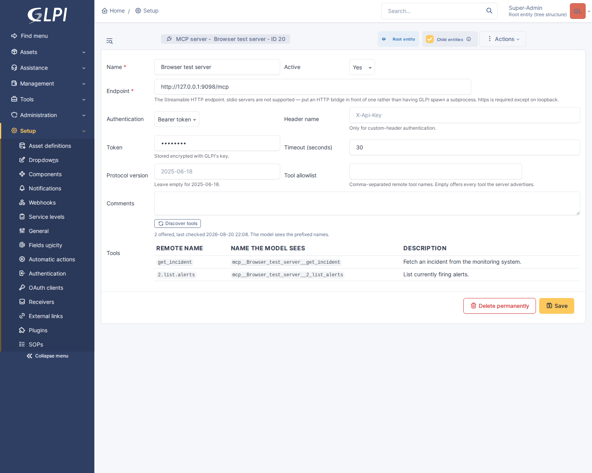

# Tool calling

A model that can look something up before answering is a different thing from
one that cannot. "Has anyone seen this before" stops being a guess and becomes a
search; "what is this machine" stops being a hallucinated model number and
becomes a record.

This document covers what ships, how another plugin adds a tool, how MCP servers
are connected, and where the limits are.


---

## The safety model, first

Three things constrain what a model can do, and they are worth stating before
anything else because everything below assumes them.

**Tools run as the signed-in user.** They go through GLPI's own search and
permission machinery, so a model working a ticket can only ever reach what the
technician driving it could have found by hand. This is not a policy applied on
top — it is what the code does, because every native tool goes through
`Search::getDatas()` rather than composing its own SQL. Hand-written queries
would be faster and would quietly leak rows.

**Tools are scoped to the conversation's entity.** `ToolContext` carries the
entity the work belongs to, and every search is ANDed with "this entity or
below". A conversation about entity 5 cannot reach entity 6 even if the
technician could have. The entity is passed explicitly rather than read from the
session, because background work has no session and a gate that resolved to
entity 0 there would be no gate.

**Writes are off by default**, and the switch is separate from the master one.
The two decisions are genuinely different: "may this data be sent to a vendor"
is contractual, "may a model write to a ticket" is operational. A wrong read
costs a few hundred tokens; a wrong write is in a ticket's history under a
technician's name.

Every tool call — what was asked for, by whom, for which entity, and whether it
failed — is written to `glpi_plugin_glpiai_toolcalls`. The usage log answers
"what did this cost"; this answers "what did the AI go looking for on this
client's tenant", which is the question a client actually asks.

---

## What ships

Fifteen native tools over GLPI's own data: eleven reads, and four writes plus a
fifth into the knowledge base.

### Reading

| Tool | Does | Right |
|---|---|---|
| `search_tickets` | Free-text ticket search, filterable by open/closed | `ticket` |
| `read_ticket` | One ticket in full: actors, SLA, assets, links, timeline, solution | `ticket` |
| `search_knowledge` | Knowledge-base search, returning article text | `knowbase` |
| `search_itil` | Changes and problems by their words, descriptions included | `change` |
| `find_asset` | Assets by name, hostname or serial, across six types | `computer` |
| `read_asset` | One asset in full: warranty, contracts, OS, software, its tickets | `computer` |
| `read_user` | A person: contact details, groups, their assets, their open tickets | `user` |
| `item_history` | What GLPI recorded changing on a record, newest first | — |
| `network_trace` | Follow a cable: which port, which switch | `networking` |
| `network_ports` | A device's ports and what is on them | `networking` |

The split between `find_asset` and `read_asset` — and between `search_tickets`
and `read_ticket` — is the one GLPI's own UI makes between a list and a form,
and for the same reason: a search may return twenty rows and can afford five
fields each; the thing you then open can afford everything.

Three of these exist because of questions the first four could not answer at
all. **Who is this person** (`read_user`) is the opening question of most
support calls, and a model reading `users_id 412` could not get past it.
**What changed** (`item_history`) is the answer to "it worked on Friday", and
it was sitting in a tab nobody opens while they are on the phone. **Is this
already known about** (`search_itil`) is where the cause usually is: six
tickets describe a symptom, and the change record from Monday night explains
it.

`item_history` has no right of its own, deliberately. GLPI gates history on
being able to see the item, which the handler checks, and there is no profile
right meaning "may read history" to gate it on instead.

### Writing

| Tool | Does | Right |
|---|---|---|
| `add_ticket_note` | An internal note on a ticket — **always private** | `followup` (UPDATE) |
| `add_ticket_task` | A task, with the time spent on it | `task` (UPDATE) |
| `update_ticket` | Category, urgency, impact, location — nothing else | `ticket` (UPDATE) |
| `link_tickets` | Related / duplicate / child / parent | `ticket` (UPDATE) |
| `draft_kb_article` | A knowledge article, created **unpublished** | `knowbase` (CREATE) |

These were held back for a long time, on the grounds that a model which can
only look things up is wrong in ways a technician notices and discards, while
one that can write is wrong in ways that end up in a ticket's history under
somebody's name. That is still true, and it turned out to be an argument about
*which* writes rather than about none. What shipped is the work a technician
does twenty times a day and resents; what did not ship is everything that
leaves the building or cannot be undone:

- **A note is always private, and no argument would change that.** A public
  followup is a reply to the customer. Making it configurable would put an
  auto-reply one checkbox away, and that checkbox would be ticked on some
  instance.
- **Nothing changes status.** Not solved, not closed, not pending. A status
  change fires notifications, stops SLA clocks, and closes work the customer
  may not agree is finished.
- **Nothing assigns.** Who owns a ticket depends on rota, skills and load —
  exactly the claim triage was cut back from making — and it is the change most
  likely to reach a requester by email.
- **Nothing edits the description or deletes anything.** The description is the
  record of what somebody reported.

`update_ticket` takes an allowlist of four fields rather than filtering a
denylist, because a denylist is one forgotten column away from letting a model
set `status`, and the forgotten column would be whichever one core adds next.
Passing `status` to it does nothing at all — the argument is not in the schema
and is never read.

Every write re-checks the item with `can()` rather than trusting the tool's
declared right: the right says this user may update tickets, and `can()` says
whether they may update *this* one, which is where the entity restriction
lives. On `link_tickets` that check runs at both ends, because a link shows on
both timelines.

### What is declared, and what is searched for

Past `tool_search_threshold` registered tools, a request declares the **pinned**
ones and leaves the rest to `find_tools`. The reads a routine question needs are
pinned; `item_history`, `search_itil` and every write are not. A model asking
"write that down" searches for a tool and finds `add_ticket_note` — one extra
turn, against several kilobytes of schema that would otherwise be on every
request whether anybody was writing anything or not.

Measured on the development instance: 50 tools registered with the plugins
active there, 25 declared up front — the count has doubled while the payload
has not moved, which is the whole point of the discipline. Every plugin below
that is installed but switched off adds its own on top.

Ticket bodies are converted from HTML with presentation deliberately off. GLPI's
default conversion is written for plain-text email — it renders `<b>` as
UPPERCASE and appends link targets as footnotes — and both destroy exactly the
strings that identify anything: hostnames, serial numbers, error codes.

---

## Using it from a feature

```php
use GlpiPlugin\Glpiai\Client;
use GlpiPlugin\Glpiai\Prompt;
use GlpiPlugin\Glpiai\ToolContext;
use GlpiPlugin\Glpiai\ToolRegistry;

$context = new ToolContext(
    (int) $ticket->fields['entities_id'],
    Ticket::class,
    (int) $ticket->getID()
);

$prompt = Prompt::make(
    "Draft a resolution for ticket {$ticket->getID()}.",
    'You are helping a technician. Look up what was done on similar tickets '
    . 'before drafting. Never invent a ticket number.'
)->withTools(ToolRegistry::all($context->entities_id));

$run = Client::run($prompt, $context);

$draft = $run->text();        // the final answer
$used  = $run->trail();       // "search_tickets → read_ticket → read_ticket"
$cost  = $run->usage();       // summed across every turn, not just the last
```

`Client::run()` loops: call the provider, execute whatever tools come back, feed
the results in, repeat. The loop lives there rather than in a feature because
every guard `Client::complete()` enforces has to hold on *every* turn — a loop
written in a caller would check the entity gate once and then make five more
calls without it.

**Tools must be put on the prompt; the loop does not attach them.** Which tools
a feature offers is part of that feature's design, and a loop that silently
handed the model everything in the registry would mean adding a tool anywhere
changed the behaviour of every feature at once. Offer the subset that makes
sense: a triage feature probably wants `search_tickets` and nothing else.

### The turn budget

`max_tool_turns` (default 6) caps how many times one request may go back to the
provider. Six is enough for search → read → search again → answer, and low
enough that a model stuck in a loop costs a few cents.

When the budget runs out with the model still asking for tools, the loop makes
one final turn with the tools taken away, so there is always prose to show —
`Conversation::$exhausted` says it happened. A completion consisting of nothing
but unanswered tool calls would otherwise have to be special-cased by every
caller.

### Failures

A tool that cannot do what was asked returns an error *result*, not an
exception. The model is the one who can fix most of these — a wrong id, a
missing argument, a tool it should not have reached for — and an exception
abandons a conversation that was one correction away from succeeding.

Only two things abort a run: the provider being unreachable, and the entity gate
refusing the call in the first place.

Ordinary refusals (`ToolException`) are deliberately not logged. A model
guessing a ticket id and missing is the loop working as designed; an error log
full of those is an error log nobody reads. Anything else that escapes a handler
is logged, because it is a defect.

---

## Adding a tool from another plugin

The registry exists so that this plugin does not have to know about anyone
else's data. glpi-sop knows what a procedure's steps say, glpi-osquery knows
what a machine looked like an hour ago, glpi-netscan knows what is on the wire.
None of that belongs here, and all of it is worth a model being able to ask for.

In your plugin's `setup.php`:

```php
$PLUGIN_HOOKS['glpiai_tools']['glpisop'] = 'plugin_glpisop_ai_tools';
```

And in `hook.php`:

```php
use GlpiPlugin\Glpiai\Tool;
use GlpiPlugin\Glpiai\ToolContext;

function plugin_glpisop_ai_tools(): array
{
    return [
        new Tool(
            name: 'sop_progress',
            description: 'Read the SOP checklist attached to a ticket: which steps '
                . 'are done, which were skipped, and the reasons given.',
            schema: [
                'type'       => 'object',
                'properties' => [
                    'tickets_id' => ['type' => 'integer', 'description' => 'The ticket id.'],
                ],
                'required'   => ['tickets_id'],
            ],
            handler: static function (array $args, ToolContext $ctx): array {
                // Check rights yourself for anything the $right field cannot express.
                return ['steps' => [/* … */]];
            },
            right: 'ticket',
            source: 'glpisop'
        ),
    ];
}
```

Notes that are easy to get wrong:

- **The description is the entire prompt.** It is the only basis on which the
  model decides to call this rather than something else. Write it as carefully
  as the code, and say when to reach for it, not just what it does.
- **Names must match `^[a-zA-Z_][a-zA-Z0-9_-]{0,63}$`** — the intersection of
  what all four vendors accept. Anything else is dropped at registration with a
  warning.
- **A collision loses.** If your name is already taken, yours is refused rather
  than overwriting: two tools answering to one name means the model calling
  something other than what it was told about, invisibly.
- **A hook that throws costs only its own tools**, not the whole feature.
- **`mutates: true`** on anything that writes. It will then only run where an
  administrator has enabled write tools.
- **`right_level` is READ unless you say otherwise**, and saying otherwise is
  often correct. GLPI rights are bitmasks, and a tool that *does* something
  usually maps to UPDATE — glpi-osquery's live query is gated on `UPDATE` of
  `plugin_glpiosquery_rawsql`, and a tool checking READ would let it through for
  anyone holding the weaker half.
- **Register the hook unconditionally.** Only glpi-ai reads it, so an instance
  without this plugin pays nothing and your class is never loaded. Guarding on
  `Plugin::isPluginActive('glpiai')` runs a database lookup on every request to
  avoid assigning an array element.
- Keep results small. Every byte returned is paid for again on the next turn.

### What ships alongside

**glpi-osquery** contributes `osquery_agents`, `osquery_tables` and
`osquery_live`. The last sends a read-only query to real endpoints, and is gated
on that plugin's free-form SQL right — which it grants to nobody by default, so
the tool can do nothing a technician could not already do by typing it into the
console themselves.

**glpi-netscan** contributes `network_alarms`, `power_status` and
`wireless_status`: the SNMP findings that have nowhere else to live. Deliberately
*not* the port inventory — that lands in GLPI's own tables, which the native
`network_trace` and `network_ports` read directly, and a second copy would give
the model two sources that can disagree.

**glpi-signal** contributes `signal_recent_alerts` and `signal_alert_context`:
what else was going wrong at the time, which is the question a ticket cannot
answer because it only records what one person noticed.

**glpi-kedb** contributes `kedb_match_ticket` and `kedb_search` — has this
already been diagnosed, and did somebody write down how to get round it. The
first runs the same matcher the ticket banner does, and deliberately does *not*
record a hit: nothing was shown to anybody, and logging one would inflate the
"shown" half of every hit rate with impressions that never happened.

**glpi-sop** contributes six. Reading: `sop_progress` and `sop_library` — the
checklist running on an item, and the procedures that exist for a kind of work.
This is the example the section above is written around, and the reason is that
a model which cannot read the site's procedure invents a generic one — and the
step it leaves out is always the site-specific one somebody wrote the procedure
for.

Writing: `sop_create`, `sop_add_steps`, `sop_update_step` and `sop_update`, all
`mutates: true` and gated on `plugin_glpisop_sop` at CREATE or UPDATE. They are
the clearest example in the suite of what a **write** tool should refuse to do,
which is more interesting than what it does:

- **No tool can activate a procedure**, or make one attach itself, or make one
  block resolution. A created procedure is off. That is not timidity about
  writes in general — the steps, the headings and the wording are all written
  without ceremony — it is that `is_active` is the whole blast radius: an
  inactive procedure is a document, and an active enforcing one holds a
  queue's tickets open. It is also that plugin's only accept signal, so a model
  that could flip it would erase the measurement.
- **No tool deletes anything.** A step is *retired* rather than removed, which
  keeps the answers recorded against it on every run that ever answered it.
- **Each handler re-checks the item, not just the right.** glpi-ai has already
  refused the tool if the user lacks `plugin_glpisop_sop`, but the right says
  nothing about *which* procedure — so every writer loads the SOP and calls
  `can(UPDATE)`, which is where the entity restriction is. Note that
  `canUpdateItem()` alone is not enough: it checks the item and not the
  profile right, so a technician with READ would have passed it.

They are also the suite's first use of `pinned: false` on tools the plugin
ships itself. Their schemas are the largest it has, and they matter on the rare
turn where somebody is writing a procedure rather than the hundred where
somebody is fixing a laptop — while the two *readers* stay pinned, so the model
always knows procedures exist here and goes looking for how to write one.
Measured on the dev instance: 25 tools declared up front before, 21 plus
`find_tools` after, and `find_tools` ranks `sop_create` first for "write this
up as a procedure".

A plugin adding write tools of its own could do worse than copy that shape:
write freely, refuse to publish, never delete, check the item as well as the
right, and leave the big schemas to the search.

**glpi-major** contributes `major_open_incidents` and `major_incident`: is this
already a known outage, and what has been published about it. The cheapest
question in support and the easiest to forget, and reading the published updates
is what stops the assistant offering a customer a reassurance nobody agreed to.

**glpi-service** contributes `service_status` and `service_impact`, which are
the same question asked from both ends: what does this customer depend on and
how healthy is it, and — given a machine that has just turned out to be at
fault — what depends on *that*. The second is what turns "this host is down"
into "their order processing is down", which is the sentence that decides
priority and who gets told. Health is served from the cached figure and carries
the time it was computed, so a model asking about six services does not set off
six health computations across a live CMDB.

**glpi-entitle** contributes `entitlement_status`: whether this customer's work
is covered, and what is left of their block hours. It is the one answer here
that is commercial rather than technical, and the one a technician is least
equipped to improvise — "we'll just rebuild it for you" is a different sentence
on a block-hours contract. The answer always carries its own age, because a
figure quoted to a customer without one is a figure they will hold you to.

**glpi-presence** contributes `who_is_on_it`: who else has this ticket open,
who is typing on it, and who has claimed the work. The collision that plugin
exists to prevent has an AI-shaped version — the assistant writes a note on a
ticket somebody picked up four minutes ago — and the tool's description tells
the model to check it *before acting*, not merely to report it.

**glpi-cloud** contributes `cloud_resources` and `cloud_spend`. Everything else
here reads the CMDB, and for a customer whose file server is an Azure VM the
CMDB is half the estate — "no asset matches" is then a true statement about
GLPI and a false one about their infrastructure. Each resource says which GLPI
asset it is projected onto, which is what tells the model whether the other
tools can reach it. Nothing acts on the cloud and nothing should: stopping
somebody's VM is not a read that went wrong, it is an outage, and the
credentials that plugin holds are read-only by design.

**glpi-identity** contributes `identity_status` and `identity_events`. "They
can't log in" is the most common ticket a service desk takes and the one a
model was previously reduced to advice on; every fact that answers it — linked
or not, active or not, refused and why, or the whole tenant failing since 09:04
— is in that plugin. It is also the plugin where read-only matters most: the
code next door creates accounts, disables them, and maps them into profiles.

**glpi-search** contributes `search_everything`: the same Meilisearch index the
command palette uses, which finds `Printre`. It exists because an exact-match
search that finds nothing looks exactly like a fact that is not recorded, and a
model will otherwise tell a technician the ticket does not exist. Its
description says to reach for it as the *second* attempt, and its degraded case
— the backend unreachable — comes back as an explicit error rather than as an
empty result, because "nothing was looked at" and "nothing matched" must not
read the same.

**glpi-report** contributes `sla_attainment`: the only tool here that answers a
question about the month rather than about a ticket. It reads the nightly
rollup rather than recomputing, so the figures a model quotes are the ones the
customer's own report shows — and it carries two properties of the underlying
arithmetic verbatim, because a model summarising numbers smooths both away:
attainment is *null* rather than 100% when nothing was measurable, and a period
that has not finished is not a result.

**glpi-improve** contributes `improvement_search` and `improvement_raise`. The
register's whole problem is that "the process is wrong, not just this ticket" is
a thought people have while they are still in the ticket, and writing it down
means a different screen; saying it to an assistant they are already talking to
is the shortest path from the thought to the record. Raising one is a write, and
a safe one: an improvement is internal, nothing acts on it, and it is created
`proposed` because every status past that needs a written outcome the plugin
refuses to skip.

**glpi-change** contributes seven — five reads and two writes, the largest set
from any one plugin.

Reading: `change_calendar` and `change_schedule` answer *what changed*, which
neither an asset database nor monitoring can. `window_source` comes back with
every change, because core's `glpi_changes` has no planned begin or end at all —
a window is derived from explicit dates, the span of the tasks, or the
resolution deadline, and the three are worth very different amounts.
`change_risk` reads the assessment, `change_standards` the catalogue of
pre-approved models, and `change_outcomes` the rollup of whether recent changes
actually worked.

Writing: `change_raise` creates a change — from a standard model where the work
matches one, free-form where it does not — and `change_plan` sets the
implementation window **and hands back what that window collides with**. That
second half is what makes it more than a setter: "can we do it Saturday night?"
becomes propose → read the warnings → move it, inside one exchange, and a
window crossing a policy freeze comes back telling the model to report it and
propose another night.

The split is the authoring half of change enablement, not the governing half. No
tool approves, validates, lifts a freeze, publishes a release or records an
outcome. Nor does one *answer the risk questionnaire*: the score drives approval
guidance, so a model filling it in would be grading its own homework, and a
completed assessment looks identical whether a person or a prompt answered it.
`change_risk` also reports the band recorded on the change's stamp separately
from any assessment run, so a pre-approved model's band is never read as
"somebody assessed this".

Note where the rights come from: the reads take this plugin's own
`plugin_glpichange_view` (and `change_standards` its catalogue page's
`plugin_glpichange_author`), while both writes take **core's** `change` right at
CREATE and UPDATE — because that is what they do. A plugin write that gated on
the plugin's right would be inventing a permission for an action core already
governs.

---

## MCP servers



Setup → AI → MCP servers. Each server is a GLPI item, so it has an entity, a
history and the ordinary rights — which is what you want, because an MSP
connecting one client's monitoring system and another's ticket tracker needs
those to be separate records with separate credentials.

| Field | Notes |
|---|---|
| Endpoint | The Streamable HTTP endpoint. **https required**, except on loopback. |
| Authentication | None, a bearer token, or a custom header. Tokens are encrypted with GLPI's key. |
| Timeout | Seconds. |
| Protocol version | Defaults to `2025-06-18`. |
| Tool allowlist | Comma-separated remote names. Empty offers everything the server advertises. |
| Entity / recursive | Which entities may use it. Recursive means a server set on a client serves its sites. |

Press **Discover tools** after saving. Discovery is deliberate rather than lazy:
asking every configured server what it can do before every completion would put
a third party's availability on the latency path of an ordinary page load, and
would do it several times over during a tool loop. A daily cron task refreshes
it, and a server being down means yesterday's tool list rather than a stalled
request.

### What is and is not supported

- **Streamable HTTP only.** The other transport MCP defines is stdio, which
  means spawning a subprocess from inside a PHP-FPM worker, on a request a
  technician is waiting for, with the web server's filesystem rights. Put an
  HTTP bridge in front of a stdio server instead.
- **Tools only.** Resources, prompts, sampling and roots are not implemented,
  and the client says so in its handshake — advertising a capability you do not
  implement is worse than advertising none, because the server will use it.
- **Static credentials only.** A bearer token or a custom header. The OAuth flow
  MCP defines for interactive clients is not implemented.
- Both `application/json` and `text/event-stream` replies are handled, because
  the spec lets the server choose per request. Only the first message of a
  stream is read; a blocking tool call has nothing to do with progress
  notifications.

### Names

An MCP tool is offered to the model as `mcp__<server>__<tool>`. Two reasons: MCP
puts no constraint on a tool name and the vendors do (no dots, no spaces, 64
characters), and two servers both offering `search` would otherwise collide. The
form shows both names side by side so it is clear what the model actually sees.

Remote schemas are passed through untouched. They come from someone else's
server and may use keywords a given vendor rejects — but trying to normalise
arbitrary third-party schemas would fail silently by mangling one, rather than
loudly by being refused.

### Every MCP tool counts as a write

MCP carries a `readOnlyHint`, supplied by the same server whose behaviour it
describes. Treating a hint from a third party as a permission decision is not a
trade worth making, so MCP tools are treated as mutating and will not run until
write tools are enabled.


## OAuth 2.1

Some services will not take a static token, and MCP's authorization spec is
ordinary OAuth wearing a hat: the server is a protected resource, it advertises
its authorization server, and a client gets a bearer token the usual way.

Choose **OAuth 2.1** as the authentication type, then press **Discover
endpoints**. A server that follows the spec publishes where its authorization
server is — `/.well-known/oauth-protected-resource`, which names an issuer,
whose `/.well-known/oauth-authorization-server` names the endpoints — and GLPI
fills both in. A server that publishes nothing leaves them to be typed.

### Which grant

**Client credentials** is the one to want, and the default. GLPI is a server
talking to another server: there is no user to consent, the token is minted on
demand, and nothing has to be re-authorized when the technician who set it up
leaves.

**Authorization code** exists for services that only ever issue user-delegated
tokens, and it comes in two shapes — see *Whose account* below. Authorized for
the instance, an administrator presses **Authorize** once, GLPI keeps the
refresh token, and renews silently from then on. Authorized per technician,
each person connects their own account and GLPI keeps one refresh token each.

The authorization-code flow uses PKCE with S256, a state parameter checked in
constant time, and RFC 8707's `resource` indicator so the token is issued *for
this MCP server* — without which an authorization server protecting several
resources may mint something the MCP server refuses, and the failure surfaces
as an opaque 401 much later.

### Whose account

*Authenticate as*, on the server form. It decides which credential every call
uses, and it is the difference between an MCP server being usable at all and
being a liability.

| | **This GLPI instance** | **Each technician, their own account** |
|---|---|---|
| Credential | One, configured by an administrator | One per person, authorised by them |
| Right to use its tools | `plugin_glpiai_config` | Having connected — nothing else |
| Where it is set up | The server form | *My settings → AI connections* |
| Background work (cron, mail collector) | Works | **Refused** |
| Reaches | What the shared credential can | What that technician can, and no more |

The instance mode is the original behaviour and is right for a server whose
data is the same for everybody: a documentation index, a status feed, a
knowledge source.

The per-technician mode exists because the interesting half of what MCP is used
for is personal. A server that reaches somebody's mailbox, their drive, their
notes or their issue tracker cannot be authenticated once for the whole
instance without either giving every technician access to one person's account,
or asking for a service account with access to everyone's. Both are the wrong
answer to a question the protocol already answers: authorization code issues a
token **for the person who consented**.

Four properties make that separation real rather than nominal:

- **One row per (server, person)**, in a table of its own, with both tokens
  encrypted by GLPI's key and named in `SECURED_FIELDS` so a key rotation
  re-encrypts them. Nothing personal is ever written to the server record.
- **There is no fallback.** A technician who has not connected is told to,
  by name, with the path to the page. A per-user server never quietly uses
  somebody else's access because that would be exactly the failure it exists to
  prevent.
- **Background work is refused.** Cron has no person, so a per-user server is
  unavailable there — stated in the refusal, rather than the job silently
  borrowing the last technician's mailbox token.
- **Nobody can read anybody else's.** Every lookup derives the user from the
  session; there is no method that takes a user id, no administrative view of
  who has connected, and no right that would grant one. A list of which
  technicians have linked their own mailbox is not something an administrator
  needs.

**The permission changes with the mode, deliberately.** An instance server's
tools are gated on the AI configuration right, because one shared credential is
what that right protects. A per-user server's tools are gated on nothing but
the connection: the token was obtained by that person consenting in their own
browser and reaches exactly what they can already reach, so requiring an
administrative right on top would mean the only people who could use their own
accounts were the ones who did not need to.

Servers that authenticate people without speaking OAuth are handled the same
way — the connections page takes a personal token the technician generated at
the other end, stored in the same per-person row with the same scoping.

An administrator setting one of these up needs to connect their *own* account
before **Discover tools** will work: discovery is a call like any other, and it
is made with the credential of whoever pressed the button.

### Tokens

Stored encrypted with GLPI's key, alongside the client secret and the in-flight
authorization exchange, and declared to `SECURED_FIELDS` so `glpi:security:changekey`
rotates them.

Renewed a minute before expiry, so one never dies in flight. That covers the
ordinary case and not the interesting one — a token revoked or rotated at the
other end is still inside its stated lifetime and still refused — so a 401 from
an OAuth server also discards the cached token and retries **once**. Static
credentials are not retried: one that is refused will be refused again, and
retrying would double every failed call.

Changing the client id, secret, token endpoint or scope discards the stored
token, because otherwise correcting a credential appears to do nothing until the
old token expires.

### The callback

`front/mcp/oauth.php`, and it is deliberately *not* anonymous: unlike a login
callback there is already a session, so it needs no firewall exception. Which
server a callback belongs to is found by matching the state against stored
pending exchanges, never from a parameter — the state is the only value in that
URL we know we issued.


## When there are too many tools

Every tool offered on a request costs its whole schema in the prompt, on every
turn, and again on each turn of an agent loop. That is the cheap half of the
problem. The expensive half is that a model choosing between twenty tools
chooses worse than one choosing between eight: descriptions blur,
near-duplicates compete, and the failure is not an error but a slightly wrong
call.

So above a threshold — **8 registered tools**, on the settings page — a request
declares a core set plus `find_tools`, and the rest become *discoverable*:

```
registered: 14        offered: search_tickets, read_ticket, search_knowledge,
                               find_asset, network_trace, network_ports, find_tools
```

The model searches in plain words, the loop adds whatever it found to the next
turn, and it calls those tools directly from then on.

Which tools stay in the core set is decided by **where they came from**, not by
an opinion about which are useful: this plugin's own tools are always offered,
and the long tail contributed by other plugins and MCP servers is what becomes
searchable. A site with two plugins and one MCP server should not discover that
`read_ticket` has quietly become a two-step operation.

Below the threshold none of this happens and everything is offered as before —
the machinery costs a round trip and is not worth paying for a handful of tools.

### The search

Word overlap against each tool's name and description, with a name match
counting double and a crude plural collapse so "machine" matches "machines".
Deliberately not something cleverer: the corpus is a few dozen sentences we
wrote ourselves, and a second retrieval system would be a second thing to keep
working.

Which does mean **the description is load-bearing twice over** — it is what the
model reads to choose, and now also what the search matches on. Say what people
would ask for, not just what the tool does. `osquery_live` lists disk space,
memory, processes and installed software in its description for exactly this
reason; without those words, "check disk space on a machine" found the schema
browser instead.

Each match reports whether the caller may actually use it, so a model told *now*
that it lacks the right picks the next best thing rather than spending a turn
finding out.

---

## Testing

`tests/tools-wire.php` asserts what each adapter *sends* — the tool declaration
going out, the call coming back, and the result going out again, for all four
vendors. That is three shapes the vendors disagree on: OpenAI passes arguments
as a JSON string inside an object, Anthropic as an object, Gemini has no call
ids and matches by name. Getting any of it subtly wrong produces a model that
simply stops calling tools, with no error anywhere.

`tests/tools.php` covers everything that needs GLPI: the rights, the entity
scoping, the write switch, the loop, the audit trail, and the MCP client against
`tests/mock-mcp.php` — a stand-in server that deliberately answers the handshake
as JSON and `tools/list` as an SSE stream, because both are legal and a client
that only ever met one of them in testing would meet the other in production.
