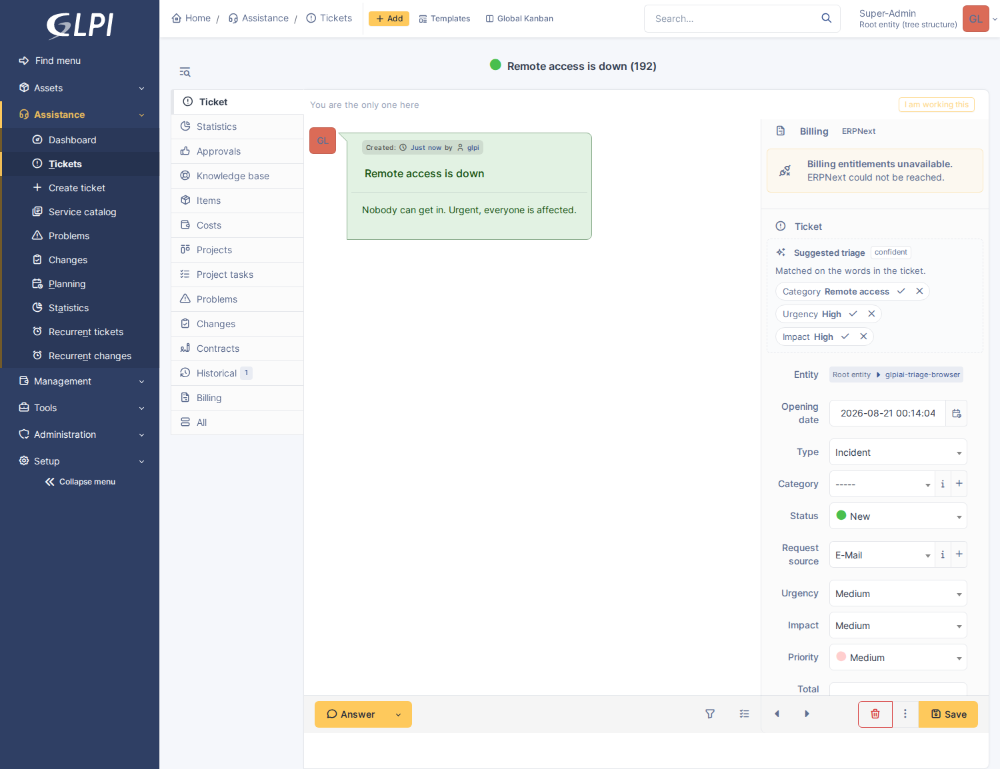

# Triage suggestions

A ticket arrives by email saying *"nobody can get in, this is urgent"*. It has
no category, urgency and impact are whatever the defaults are, and the procedure
that documents how to handle it is sitting in glpi-sop unattached.

Triage proposes all of that, as chips above the ticket fields:

Nothing is applied until somebody clicks. There is no setting that changes that.

---

## The line this feature does not cross

This is the first feature in the plugin that offers to change a ticket, so it is
worth being explicit about where the boundary is and how it is held.

- **The model never writes.** It produces a row in a table. A technician's click
  is what calls `Ticket::update()`, under their own name, in their own history.
  There is no code path that writes without one, and no configuration that adds
  one.
- **A requester never sees it.** The panel renders only in the technician
  interface. A suggestion chip on a customer's own ticket would put a model's
  opinion in front of them, which is the one thing the roadmap rules out.
- **A wrong suggestion costs a click.** That is the whole reason this can ship
  before it is perfect: dismissing a bad chip takes a second, and the dismissal
  is recorded, which is how it gets better.

---

## Which tickets get triaged

By default, the ones somebody wrote in prose: tickets whose request type is
GLPI's **helpdesk default** or **mail default** — the portal and the mail
collector. A ticket a technician raised by filling in the form already has a
category, and asking a model to second-guess it spends money to be told what is
already on the screen. That is also what the **skip tickets raised from the
technician interface** switch is for, and it is on by default.

Both are configurable under **Setup → Plugins → AI → Triage suggestions**. The
request-type list accepts any of GLPI's types, so a site whose phone tickets are
also terse can add Phone.

Four other things stop it, and each is a deliberate layer rather than a
duplicate:

| Condition | Why it is separate |
|---|---|
| The master AI switch | Nothing is sent to any provider for any reason |
| The triage switch | A site may want retrieval and not suggestions |
| The entity gate | Some customers forbid their data leaving the estate |
| The request-type list | Cost control, per source |

---

## When it runs

Queued at creation, executed by cron. The cron task runs every five minutes and
does a batch.

It is worth understanding why it is not inline. The request that creates a
ticket is, for anything from the customer portal, a person waiting on a submit
button — and for anything from the mail collector, a cron job whose runtime
would start depending on an external API. Neither should be made to wait on a
vendor. So creating a ticket writes one row locally and returns.

The panel closes the gap for anyone who arrives first: a queued ticket shows
**Suggest now**, which runs it there and then. A ticket whose suggestion failed
shows why, and offers **Try again**.

---

## What the model is given

Two halves, deliberately separated.

The **system instruction** is the taxonomy: every category the entity can
actually use, with its comment; the urgency and impact scale in GLPI's own
words; the active glpi-sop procedures; and the rules. It is identical for every
ticket in an entity, byte for byte, which is the shape a provider's prompt cache
is designed to make cheap.

The **user turn** is the ticket: its title, its description, and — importantly —
its current category, urgency and impact. Without those the model cannot tell
"this is already right" from "nobody has decided yet", and the panel fills with
chips proposing what the ticket already says.

The answer comes back as a schema-validated object on the `fast` model tier,
with an output budget of 1500 tokens for an answer that is about eighty.

That ratio is deliberate. A reasoning model spends its allowance thinking before
it writes anything, and a budget sized for the answer produces a response with
`finish_reason: length`, an empty message and a thousand words of discarded
thought — a failure that looks identical to a malformed answer and suggests
nothing about its own cause. If it happens anyway, the panel says so in those
words rather than reporting an unusable object.

### Nothing in the answer is trusted

The taxonomy is also the allowlist. A category id is accepted only if it is one
the model was actually offered in that entity, so a hallucinated id becomes "no
suggestion" rather than a category that does not exist — or, worse, one from
another customer's tree. Urgency and impact are clamped to 1–5. A field that
fails validation is dropped on its own; a model that gets one thing wrong is
still useful about the other three.

---

## Measuring whether it is any good

Every field carries its own outcome, and the settings page reports the rate:

| Field | Accepted | Dismissed | Already right | Accept rate |
|---|---|---|---|---|
| Category | 142 | 31 | 88 | **82%** |
| Urgency | 40 | 55 | 210 | **42%** |

Two things about that table are deliberate.

**Per field, not overall.** A model can be reliable about category and hopeless
about urgency — the numbers above are what that looks like — and one figure
averaged over both would hide it. If urgency is not earning its keep at your
site, that is a visible fact rather than a feeling.

**"Already right" is its own column and is excluded from the rate.** A
suggestion that merely agrees with what the ticket already said is not a win;
nobody decided anything. Counting those as accepts is the easiest way to publish
an accuracy figure that is mostly measuring GLPI's own defaults.

An undecided suggestion counts as neither. It is not evidence either way, and
letting it into the denominator would make the rate drift downwards purely
because tickets are still fresh.

---

## The procedure chip

When **glpi-sop** is installed, its active procedures for tickets are offered
too, and accepting one starts a run — a checklist in the ticket's timeline,
not a foreign key on a column.

The run records its origin as *"suggested by AI, accepted by a technician"*,
which is the accurate description: nothing in either plugin lets a model attach
a procedure by itself.

Without glpi-sop the chip simply never appears. Every reference to it is a
string behind a guard; this plugin has no dependency on it.

---

## Rights

Seeing the panel takes no right beyond seeing the ticket. That is deliberate:
`plugin_glpiai_config` belongs to whoever holds the provider credentials — an
administrator — and gating a technician's chips behind it would make the feature
invisible to everybody it was built for.

Acting on a chip is a different question, answered per ticket by
`Ticket::canUpdateItem()`: once for whether to draw the apply button, and again
in the endpoint, which is the check that counts. Dismissing needs less than
applying, because recording that somebody said no changes nothing about the
ticket — and requiring update rights to reject a suggestion would let read-only
technicians silently poison the accept rate by leaving everything undecided.

---

## When nothing appears

- **No panel at all.** The ticket was never queued. Check the request type
  against the configured list, and whether it was raised from the technician
  interface with that skip switch on.
- **"Queued" that never becomes chips.** GLPI's cron is not running the
  `triage` task. Press **Suggest now** to confirm the provider works, then look
  at **Setup → Automatic actions**.
- **A failure message.** It is the provider's own, verbatim. The **Test
  connection** button on the settings page exercises the same path.
- **Chips for things the ticket already says.** Should not happen — those are
  marked *already right* on the way in — but a ticket edited between the
  suggestion being made and the panel being drawn will drop the chip rather than
  offer it.
